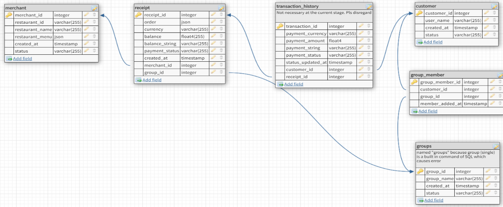

# warican

This repository was created during our time as students at Code Chrysalis. 
このリポジトリはCode Chrysalisの生徒であるときに作成しました。

 
 

 
 

Warican is an ultimate smartphonen application for people who love to eat out with friends but hate the hassle of splitting the bill.

## 1. Our persona

Ayaka (age 24) works for a financial company in Tokyo. Her passion is organizing occasions to eat out with her friends. As she lives on her own, and so do many of her friends, they usually split the bill. She enjoys the whole experience of dining together, including searching restaurants, finding out friends' schedules, except the hassle of splitting the pay at the end of the meal. For her, the process of counting how much everybody is due and going around the table to collect cash is such an uninspiring thing to do. Also, she is now accustomed to using cashless payment elsewhere and loathes handling cash. 

## 2. Name

The name warican comes from a Japanese word, warikan（割り勘）which means splitting the bill. And the use of "can" in the name indicates the user can indeed split the bill easily. 

## 3. Usage

Users use this application is their smartphone. A group of users who split the bill first select the names of their friends they eat with from the friend list. This way, they make a group. They also need to input the id of the bill the restaurant issues into the application. The users would immediately see the total amount and the amount each is due on the screen. Once they confirmed the amount, they can hit the payment button, which will bring them to a payment page. Then they would input their email address and credit information. They hit the button to pay. Once the payment is successfully completed, the screen switches to the success page, showing that payment is done.  

Throughout the transaction, the event organizer doesn't need to calculate how much money each person is due or worry about the change.

## 4. How it works

The warican server keeps the data of restaurants and users who have signed up for the service. When somebody eats at a merchant (restaurant registered with the service), that merchant will enter the transaction information (i.e., a meal) into the service. That information includes the total balance and orders (what dishes they served). 

If a group of service users wants to split a bill, they first need to sign in to the service and click on the friends they are eating with on the friends list. This user action allows the application to know how many users are going to share a bill. When the user inputs the receipt's ID, the application will get from the server the data about that transaction. 

The tables in the database

Starting from the left, you see the merchant table, the receipt (bill) table, the transaction table, the customer table, the group member table (this a joint table), and the groups table. This time, we used the merchant table and the receipt table only.

Based on the transaction total and the number of users, the application calculates and displays how much each person is due. With a click of a button, the application brings the user to the payment page of Stripe Checkout. Thus the compliance regarding the payment is ensured by Stripe. Once the payment is done on that page, the user is brought back to the application's success page. 
 

## 5. Technology used

This software was built with the following technologies.

## 6. Future features

For this stage, we implemented the core of the service, but to realize our persona's go\al, we envision to:

* Login function.

* Ability to notify the event organizer/host to show which participants have paid. 

* Ability to adjust each person's payment amount and recalculate other people's amount automatically. 

* Build up the database to hold the status of payment of each person. This will enable the above two features.

## 7. Authors 

Co-authors of this application: 

* Eliot Austin-Forbes 
* Naoto　Maeda
* Sayaka Nakajima
* Kaisei Suzuki
* Mio Maeshima

## 8. Acknowledgments

We are indebted to the genuine support and insightful advice by  
* Rafael Viana 
* Eriko Kidera  
* Yusuke Yamada 

## 9. Liecense   MIT

